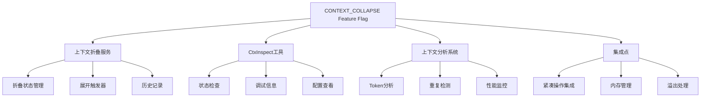
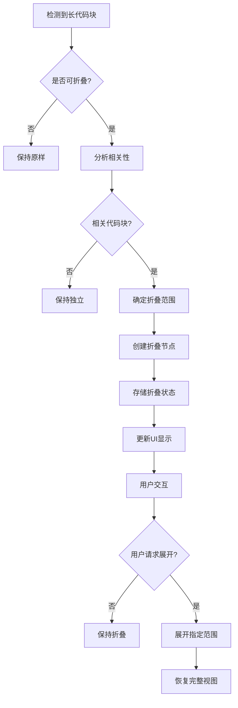

# CONTEXT_COLLAPSE Feature Flag 详细分析

## 🎯 核心作用

`CONTEXT_COLLAPSE` feature flag 启用 **上下文折叠系统** - 一个智能的代码上下文管理和优化框架，用于在大型代码库中高效地展开和折叠相关代码片段，提高开发者的代码可读性和导航效率。

## 📋 主要功能组件

### 1. 上下文折叠服务 (src/services/contextCollapse/)
- **初始化**: `initContextCollapse()` 启动上下文折叠服务
- **统计信息**: `getStats()` 提供折叠操作的统计报告
- **健康检查**: `ContextCollapseHealth` 监控系统健康状况
- **状态管理**: 跟踪折叠和展开的操作历史

### 2. CtxInspect工具 (src/tools/CtxInspectTool/)
- **上下文检查**: 分析和显示当前上下文的折叠状态
- **调试支持**: 提供详细的上下文信息用于问题诊断
- **状态查询**: 实时查询折叠操作的执行情况

### 3. 上下文分析系统 (src/utils/contextAnalysis.ts)
- **Token统计**: `analyzeContext()` 分析消息中的token使用情况
- **重复检测**: 识别重复的文件读取操作
- **性能度量**: `tokenStatsToStatsigMetrics()` 转换为可监控指标
- **上下文优化**: 基于使用模式的智能建议

### 4. 集成点
- **紧凑操作**: 与自动压缩系统集成
- **内存管理**: 会话内存管理的优化
- **溢出处理**: 处理上下文窗口溢出的策略

## 🔧 工作原理

### 上下文折叠架构


### 上下文折叠决策流程


## 🚀 使用方式

### CLI 命令
```bash
# 检查上下文折叠状态
claude context collapse status

# 分析当前上下文
claude context collapse analyze

# 重置折叠状态
claude context collapse reset

# 调试上下文问题
claude ctx-inspect --debug
```

### 编程访问
```typescript
// 检查是否启用上下文折叠
if (feature('CONTEXT_COLLAPSE')) {
  const stats = require('./services/contextCollapse/index.js').getStats();
  console.log('Collapsed spans:', stats.collapsedSpans);
}

// 应用上下文折叠
const result = await require('./services/contextCollapse/index.js').applyCollapsesIfNeeded(
  messages,
  toolUseContext,
  querySource
);

// 检查提示词长度
const isTooLong = require('./services/contextCollapse/index.js').isWithheldPromptTooLong(
  message,
  isPromptTooLongMessage,
  querySource
);
```

### 配置选项
```json
{
  "contextCollapse": {
    "autoCollapse": true,           // 自动折叠不相关的代码
    "maxSpanLength": 5000,          // 最大折叠跨度长度
    "preserveStructure": true,      // 保持代码结构完整性
    "showPreview": true,            // 显示折叠预览
    "collapseThreshold": 0.8         // 折叠阈值(80%)
  }
}
```

## 📊 技术实现细节

### 统计数据结构
```typescript
// src/services/contextCollapse/index.ts
export interface ContextCollapseHealth {
  totalSpawns: number        // 总启动次数
  totalErrors: number        // 总错误数
  lastError: string | null   // 最后错误信息
  emptySpawnWarningEmitted: boolean  // 空启动警告已发送
  totalEmptySpawns: number   // 总空启动次数
}

export interface ContextCollapseStats {
  collapsedSpans: number     // 折叠跨度数
  collapsedMessages: number  // 折叠消息数
  stagedSpans: number        // 暂存跨度数
  health: ContextCollapseHealth  // 健康状态
}
```

### 上下文分析算法
```typescript
// src/utils/contextAnalysis.ts
function analyzeContext(messages: Message[]): TokenStats {
  // 统计各种类型的token使用
  // 检测重复文件读取
  // 计算百分比分布
  return {
    toolRequests: new Map(),   // 工具请求统计
    toolResults: new Map(),    // 工具结果统计
    humanMessages: 0,          // 人类消息token数
    assistantMessages: 0,      // AI助手消息token数
    localCommandOutputs: 0,    // 本地命令输出token数
    other: 0,                  // 其他内容token数
    attachments: new Map(),    // 附件类型统计
    duplicateFileReads: new Map(),  // 重复文件读取统计
    total: 0                   // 总token数
  };
}
```

### 折叠结果结构
```typescript
// src/services/contextCollapse/index.ts
export interface CollapseResult {
  messages: Message[]  // 处理后的消息数组
}

export interface DrainResult {
  committed: number    // 已提交的消息数
  messages: Message[]  // 剩余的消息数组
}
```

## 🎯 主要优势

1. **提高可读性**: 通过折叠不相关的代码块，突出显示重要内容
2. **节省空间**: 减少视觉杂乱，优化界面布局
3. **智能导航**: 快速跳转到相关代码区域
4. **性能优化**: 减少渲染负担，提高响应速度
5. **上下文感知**: 基于代码关系的相关性分析

## ⚠️ 技术注意事项

### 架构约束
- **ANT-only**: 主要用于内部开发团队，外部版本有限支持
- **静态导入**: 使用require()动态加载避免代码泄露
- **死代码消除**: 构建时根据feature flag进行条件编译

### 性能考虑
- **内存占用**: 折叠状态的存储和管理开销
- **计算复杂度**: 相关性分析的算法复杂度
- **渲染性能**: UI更新的频率和优化

### 数据一致性
- **状态同步**: 折叠状态在不同组件间的同步
- **持久化**: 折叠配置的保存和恢复
- **冲突解决**: 多个折叠操作的优先级处理

## 📈 影响范围

该功能影响以下关键系统:

### 1. 设置系统 (src/setup.ts)
- **初始化**: 在应用启动时初始化上下文折叠服务
- **条件加载**: 根据feature flag决定是否加载相关模块
- **错误处理**: 折叠服务的错误处理和恢复机制

### 2. 工具池 (src/tools.ts)
- **工具注册**: 注册CtxInspectTool到可用工具列表
- **功能切换**: 根据feature flag控制工具的可用性
- **依赖管理**: 工具之间的依赖关系管理

### 3. 上下文分析 (src/utils/contextAnalysis.ts)
- **Token统计**: 详细的token使用分析和报告
- **重复检测**: 识别和优化重复的文件读取操作
- **性能监控**: 提供可量化的性能指标

### 4. 紧凑服务 (src/services/compact/)
- **溢出处理**: 处理上下文窗口溢出的策略
- **消息管理**: 消息的折叠和展开操作
- **边界处理**: 紧凑操作与折叠系统的集成

## 🔄 典型使用场景

### 大型代码库导航
```
1. 用户在大型前端项目中查找特定功能
2. 系统自动折叠不相关的组件和样式
3. 只展开包含目标功能的代码块
4. 用户可以通过点击快速展开/折叠相关区域
5. 保持工作区域的整洁和专注
```

### 代码审查优化
```
1. 审查者打开PR进行代码审查
2. 系统折叠掉测试文件和配置文件
3. 突出显示主要的业务逻辑变更
4. 提供折叠摘要便于快速浏览
5. 支持按文件类型或修改类型进行过滤
```

### 学习新代码库
```
1. 新用户加入项目，需要理解代码结构
2. 系统提供分层折叠的代码概览
3. 用户可以逐步展开感兴趣的部分
4. 自动高亮显示核心概念和模式
5. 提供上下文相关的文档链接
```

## 🛡️ 安全考虑

### 多层防护机制
1. **输入验证**: 严格验证所有折叠操作的输入参数
2. **权限控制**: 确保用户只能访问授权的代码区域
3. **数据隔离**: 不同项目或文件的折叠状态完全隔离
4. **审计日志**: 完整的折叠操作历史记录

### 应急措施
- **快速恢复**: 支持随时恢复到未折叠的原始状态
- **回滚能力**: 能够撤销最近的折叠操作
- **故障隔离**: 单文件折叠失败不影响其他文件
- **权限撤销**: 可以立即停止特定区域的折叠功能

## 📚 应用场景

### 适合使用上下文折叠的场景
1. **大型项目**: 包含数千个文件的复杂项目
2. **多语言项目**: 混合多种编程语言的项目
3. **遗留代码**: 需要理解的大型遗留系统
4. **团队协作**: 多人协作的代码库
5. **代码审查**: 复杂的Pull Request审查

### 不适合上下文折叠的场景
1. **小型项目**: 文件数量很少的简单项目
2. **线性阅读**: 只需要顺序阅读的场景
3. **初学者**: 刚开始学习编程的新手
4. **特殊格式**: 非文本文件或二进制文件
5. **实时协作**: 需要实时共享屏幕的场景

## 🔮 未来发展方向

### 可能的增强功能
1. **AI驱动**: 基于机器学习的相关性分析
2. **语义折叠**: 基于代码语义的智能折叠
3. **自定义规则**: 用户定义的折叠规则和模板
4. **可视化编辑**: 拖拽式的折叠界面编辑器
5. **插件扩展**: 第三方折叠插件的支持

### 企业级功能
1. **团队协作**: 共享折叠配置和预设
2. **版本控制**: 折叠配置的Git版本管理
3. **自动化**: 基于CI/CD的自动折叠策略
4. **性能分析**: 详细的折叠性能报告和优化建议
5. **集成开发**: 与IDE的深度集成

该 feature flag 代表了 Anthropic 在代码可读性和开发者体验方面的创新探索，为处理复杂软件工程任务提供了强大的基础设施支持！