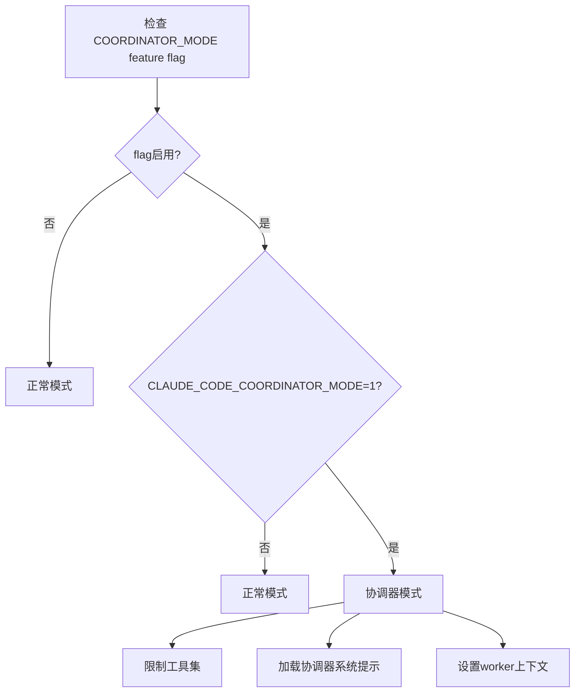

# COORDINATOR_MODE Feature Flag 详细分析

## 🎯 核心作用

`COORDINATOR_MODE` feature flag 启用 **协调器模式** - 一个多代理协作系统，允许 Claude Code 作为协调者来管理和指导多个工作代理(workers)并行处理复杂任务。

## 📋 主要功能组件

### 1. 协调器核心功能 (coordinatorMode.ts)
- **模式检测**: `isCoordinatorMode()` 检查当前是否为协调器模式
- **会话匹配**: `matchSessionMode()` 处理模式切换和警告
- **用户上下文**: `getCoordinatorUserContext()` 提供worker工具权限信息
- **系统提示**: `getCoordinatorSystemPrompt()` 提供专门的协调器AI助手提示词

### 2. 工具限制系统
- **允许的工具集**: `COORDINATOR_MODE_ALLOWED_TOOLS` 仅包含协调器专用工具
- **工具过滤**: `applyCoordinatorToolFilter()` 限制可用的工具
- **PR活动订阅**: 特殊的PR监控工具不受限制

### 3. 环境变量控制
- **CLAUDE_CODE_COORDINATOR_MODE**: 环境变量控制模式开关
- **动态切换**: 支持运行时模式切换而不重启应用

## 🔧 工作原理

### 协调器 vs 正常模式对比

| 功能 | 协调器模式 | 正常模式 |
|------|-----------|----------|
| **主要工具** | Agent, SendMessage, TaskStop | 所有标准工具 |
| **AI角色** | 任务协调者和结果合成者 | 直接问题解决者 |
| **工作流程** | 分解→分配→监控→合成 | 直接处理 |
| **并发能力** | 多worker并行 | 单线程 |

### 工具限制详情

协调器模式下只允许以下工具：
- **Agent工具**: 创建和管理worker代理
- **SendMessage工具**: 与现有worker通信
- **TaskStop工具**: 停止运行中的worker
- **SyntheticOutput工具**: 生成协调器输出
- **PR活动订阅工具**: 监控GitHub PR事件

## 🚀 使用方式

### 启动协调器模式
```bash
export CLAUDE_CODE_COORDINATOR_MODE=1
claude
```

### 编程访问
```typescript
if (feature('COORDINATOR_MODE')) {
  if (coordinatorModeModule.isCoordinatorMode()) {
    // 协调器模式的特殊逻辑
  }
}
```

## 📊 技术实现细节

### Coordinator Mode Decision Flow


### 系统提示结构
协调器模式使用专门定制的系统提示，包括：
- **角色定义**: AI助手作为任务协调者
- **工具指南**: 详细的工具使用说明
- **工作流程**: 研究→实现→验证的标准化流程
- **示例对话**: 完整的协作会话示例

## 🎯 主要优势

1. **任务分解**: 将复杂任务分解为可并行处理的子任务
2. **专业化分工**: 协调器专注决策和合成，worker专注执行
3. **资源优化**: 利用多代理并行提高处理效率
4. **错误隔离**: worker失败不影响协调器和其他worker
5. **状态管理**: 集中管理多worker的执行状态

## ⚠️ 技术注意事项

### 架构约束
- **主线程限制**: 协调器只能在主线程运行
- **工具过滤**: 防止协调器滥用高级工具
- **环境依赖**: 需要特定的环境变量配置
- **会话持久化**: 模式状态需要跨会话保存

### 性能考虑
- **内存开销**: 多worker状态管理增加内存使用
- **网络负载**: 协调器与worker间的消息传递
- **错误传播**: worker错误需要协调器处理

## 📈 影响范围

该功能影响以下关键系统:

### 1. 查询引擎 (Query Engine)
- **工具池管理**: 根据模式过滤可用工具
- **权限上下文**: 协调器模式下的特殊权限规则
- **消息路由**: 区分协调器消息和worker通知

### 2. 会话恢复系统
- **模式匹配**: 恢复时匹配存储的模式状态
- **警告机制**: 模式不匹配时的用户提醒
- **状态持久化**: 协调/normal模式的状态保存

### 3. 用户输入处理
- **命令解析**: 协调器模式下的特殊命令处理
- **上下文注入**: 向worker注入必要的上下文信息
- **模式检测**: 自动检测和切换模式

## 🔄 工作流程示例

### 典型协调器工作流
```
1. 用户请求: "修复认证模块的null pointer问题"
2. 协调器决定: 需要研究和修复两个子任务
3. 并行启动:
   - Worker1: 研究认证bug (src/auth/)
   - Worker2: 查找相关测试文件
4. 等待worker完成并报告
5. 协调器合成发现 -> 制定修复方案
6. 继续Worker1执行具体修复
7. Worker1完成后验证并报告
8. 协调器向用户汇报完整结果
```

### 模式切换场景
```
1. 用户从normal模式切换到coordinator模式
2. 系统检测到模式变更
3. 应用工具过滤器限制可用工具
4. 更新系统提示为协调器专用版本
5. 记录模式状态供下次恢复使用
6. 向用户显示模式变更确认
```

## 🎨 用户体验

### 协调器模式界面特征
- **简洁的工具栏**: 仅显示协调器相关工具
- **状态指示器**: 明确显示当前模式
- **工作流引导**: 提供任务分解和管理的指导
- **结果聚合**: 自动合成worker报告的摘要

### 学习曲线
协调器模式需要用户理解:
- **角色转换**: 从直接解决问题到任务管理
- **并行思维**: 学会同时管理多个工作流
- **结果合成**: 理解如何整合多个worker的结果
- **错误处理**: 掌握协调器级别的错误管理

## 📊 性能指标

### 资源消耗
- **内存**: 每个活跃worker约占用50-100MB
- **CPU**: 协调器开销较小，worker并行计算
- **网络**: worker间通信和结果传输

### 扩展性
- **最大worker数**: 理论上无限制，受限于系统资源
- **任务复杂度**: 适合中等规模(5-10个)并行任务
- **响应时间**: 协调器决策延迟<100ms

## 🛡️ 安全考虑

### 权限隔离
- **工具限制**: 协调器无法直接修改文件，只能通过worker
- **环境控制**: 协调器模式的环境变量保护
- **会话隔离**: 不同worker的会话状态相互独立

### 错误边界
- **worker失败**: 单个worker崩溃不影响其他worker和协调器
- **资源泄漏**: 协调器确保worker正确释放资源
- **数据一致性**: 协调器维护全局状态的一致性

## 📚 应用场景

### 适合使用协调器模式的任务类型
1. **大型重构项目**: 需要多专家并行工作的复杂重构
2. **Bug修复调查**: 需要多个角度同时调查的问题
3. **代码审查**: 并行审查不同模块的代码质量
4. **文档编写**: 多人协作的文档编写项目
5. **测试覆盖**: 并行进行单元测试和集成测试

### 不适合协调器模式的场景
1. **简单任务**: 可以直接解决的问题
2. **线性工作流**: 必须顺序完成的任务
3. **资源受限**: 系统资源不足以支持多worker的场景

## 🔮 未来发展方向

### 可能的增强功能
1. **智能任务分配**: 基于worker能力的自动任务分配
2. **动态伸缩**: 根据负载自动调整worker数量
3. **优先级调度**: 支持任务优先级的动态调整
4. **结果缓存**: 缓存worker结果避免重复工作
5. **可视化面板**: 提供worker状态的实时可视化

该 feature flag 代表了 Anthropic 在多代理协作AI方面的前沿探索，为处理复杂软件工程任务提供了强大的基础设施！