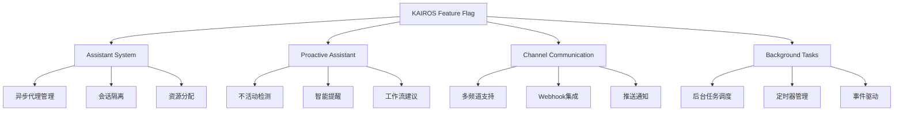
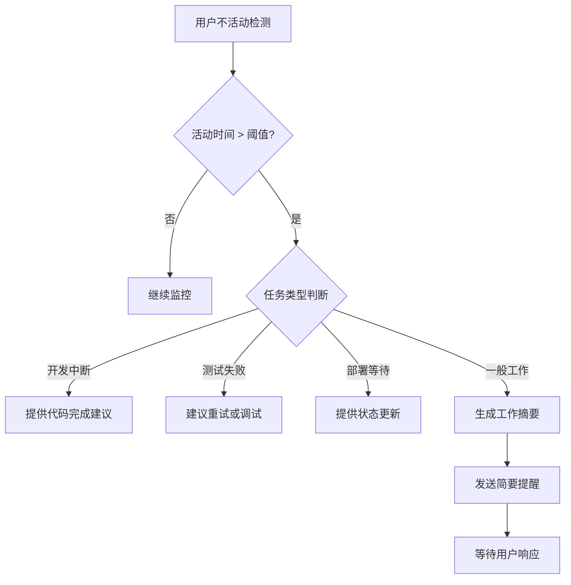

# KAIROS Feature Flag 详细分析

## 🎯 核心作用

`KAIROS` feature flag 启用 **Kairos 主功能** - 一个异步代理系统和主动助手框架，为 Claude Code 提供智能的后台任务处理、主动提醒和协作能力。

## 📋 主要功能组件

### 1. 异步代理系统 (assistant/)
- **Assistant模式**: 独立的AI助手会话管理
- **Gate检查**: `kairosGate` 进行权限验证
- **团队协作**: `assistantModule` 管理多代理协作
- **SDK集成**: Agent SDK 深度集成

### 2. 主动助手功能
- **Proactive模式**: 用户不活动时的自动干预
- **Brief工具**: 简洁的助手功能
- **Away Summary**: 长时间不活动的摘要生成
- **实时提醒**: 基于事件的智能提醒系统

### 3. 频道通信系统
- **Kairos Channels**: 多频道消息传递支持
- **GitHub Webhooks**: GitHub事件集成
- **推送通知**: 实时通知功能
- **深度链接**: URL处理和系统集成

### 4. 命令行接口
- **assistant命令**: 启动和管理助手会话
- **brief命令**: 简洁助手功能
- **subscribe-pr**: GitHub PR订阅管理
- **proactive命令**: 主动干预控制

## 🔧 工作原理

### Kairos 架构设计


### 异步代理执行流程
1. **代理创建**: 通过Assistant工具创建新的异步代理
2. **上下文注入**: 加载相关的项目上下文和历史信息
3. **任务执行**: 在独立环境中执行复杂任务
4. **状态监控**: 实时监控代理执行状态
5. **结果收集**: 汇总代理执行结果并通知用户

### 主动助手决策逻辑


## 🚀 使用方式

### CLI 命令
```bash
# 启动Kairos助手
claude --assistant

# 启动特定会话ID的助手
claude assistant <session-id>

# 启用proactive模式
claude --proactive

# 管理GitHub PR订阅
claude subscribe-pr <repo> <pr-number>

# 查看brief状态
claude brief status
```

### 编程访问
```typescript
// 检查KAIROS是否启用
if (feature('KAIROS')) {
  const assistantModule = require('./assistant/index.js');
  
  // 初始化助手团队
  const teamContext = await assistantModule.initializeAssistantTeam();
  
  // 检查助手模式
  if (assistantModule.isAssistantMode()) {
    // 助手模式下的特殊逻辑
  }
}

// Proactive模式检查
if (feature('PROACTIVE') || feature('KAIROS')) {
  // 启用主动干预功能
}
```

### 环境变量配置
```bash
# 启用KAIROS助手
export CLAUDE_CODE_KAIROS=1

# 启用proactive模式
export CLAUDE_CODE_PROACTIVE=1

# 设置工作负载标签
export CC_WORKLOAD=development-team

# 启用GitHub Webhook
export KAIROS_GITHUB_WEBHOOKS=1
```

## 📊 技术实现细节

### 助手状态管理
```typescript
// src/main.tsx 中的状态跟踪
let _pendingAssistantChat: PendingAssistantChat | undefined = feature('KAIROS')
  ? { sessionId: undefined, discover: false }
  : undefined;
```

### 频道通信结构
```typescript
type ChannelEntry = {
  name: string;
  type: 'plugin' | 'server';
  trustModel: 'marketplace' | 'dev';
  marketplaceInfo?: {
    id: string;
    name: string;
  };
};
```

### 异步代理数据结构
```typescript
interface AssistantTeamContext {
  agentId: string;
  agentName: string;
  teamName: string;
  color: string;
  planModeRequired: boolean;
  parentSessionId?: string;
}
```

## 🎯 主要优势

1. **异步处理能力**: 复杂的AI任务可以在后台并行执行
2. **主动智能**: 基于用户行为的预测性和主动性
3. **团队协作**: 多代理协同工作的基础设施
4. **实时通信**: 多频道消息系统和事件驱动架构
5. **资源优化**: 智能的资源分配和任务调度

## ⚠️ 技术注意事项

### 架构约束
- **ANT-only**: 主要用于内部开发团队，外部版本有限支持
- **内存管理**: 异步代理需要精细的内存和资源管理
- **错误隔离**: 单个代理失败不应影响其他代理
- **会话隔离**: 不同代理之间的数据隔离和安全

### 性能考虑
- **并发控制**: 限制同时运行的代理数量
- **响应时间**: 确保主动提醒不会过度打扰用户
- **资源配额**: 为每个代理分配合理的计算资源
- **缓存策略**: 智能的上下文缓存避免重复加载

### 安全边界
- **权限验证**: 所有代理操作都需要适当的权限检查
- **数据隔离**: 严格的数据访问控制和隐私保护
- **审计日志**: 完整的代理活动记录
- **紧急停止**: 支持随时停止危险或异常的代理

## 📈 影响范围

该功能影响以下关键系统:

### 1. 主程序入口 (src/main.tsx)
- **选项解析**: 添加--assistant等KAIROS相关选项
- **模式检测**: 识别和处理KAIROS相关命令
- **系统提示**: 根据KAIROS状态调整AI行为

### 2. 命令行系统 (src/commands.ts)
- **命令注册**: 注册assistant、brief等相关命令
- **参数处理**: 处理KAIROS相关的命令行参数
- **错误处理**: KAIROS特有错误的友好提示

### 3. 分析遥测 (src/services/analytics/metadata.ts)
- **事件标记**: kairosActive字段记录助手模式状态
- **行为分析**: 跟踪KAIROS功能的用户使用情况
- **性能监控**: 监控异步代理的执行性能

### 4. 工具池 (src/utils/toolPool.ts)
- **工具过滤**: 根据KAIROS状态过滤可用工具
- **权限控制**: 助手模式下的特殊权限规则
- **资源分配**: 动态的工具资源分配策略

## 🔄 典型使用场景

### 异步代码审查工作流
```
1. 用户提交PR请求
2. Kairos创建审查代理
3. 代理并行执行:
   - 代码质量扫描
   - 安全漏洞检查
   - 测试覆盖率分析
4. 代理生成详细报告
5. Kairos向用户推送摘要
6. 用户可以选择继续审查或批准
```

### 主动开发助手
```
1. 用户在编辑器中暂停超过5分钟
2. Proactive系统检测到不活动
3. 系统分析当前项目状态
4. 提供可能的下一步行动建议:
   - "你有一个失败的测试，需要修复"
   - "API文档已过期，需要更新"
   - "可以运行代码格式化"
5. 用户可以选择接受建议或忽略
```

### 多代理协作开发
```
1. 用户启动复杂重构任务
2. Kairos创建多个专用代理:
   - 架构分析代理
   - 代码迁移代理
   - 测试更新代理
3. 代理并行工作并定期报告
4. 主代理协调进度并解决冲突
5. 完成时生成综合报告
```

## 🛡️ 安全考虑

### 多层防护机制
1. **权限验证**: 所有代理操作都需要明确的授权
2. **输入过滤**: 严格验证代理接收的所有输入
3. **输出控制**: 限制代理产生的输出内容
4. **会话隔离**: 确保不同代理之间完全隔离

### 应急措施
- **快速终止**: 支持随时停止任何正在运行的代理
- **回滚能力**: 能够恢复到之前的稳定状态
- **故障隔离**: 单代理失败不影响其他代理
- **权限撤销**: 可以立即撤销特定代理的权限

## 📚 应用场景

### 适合使用KAIROS的场景
1. **复杂重构**: 需要多专家协作的大型重构项目
2. **持续集成**: CI/CD管道中的自动化审查和测试
3. **代码质量**: 持续的代码质量监控和改进
4. **学习辅助**: 为新用户提供智能化的开发指导
5. **团队协作**: 分布式团队的开发协调

### 不适合KAIROS的场景
1. **简单任务**: 可以直接解决的简单问题
2. **交互式操作**: 需要用户实时决策的操作
3. **敏感数据**: 涉及高度敏感数据的操作
4. **合规要求**: 需要严格人工监督的场景

## 🔮 未来发展方向

### 可能的增强功能
1. **机器学习优化**: 基于历史数据的智能任务分配
2. **自然语言接口**: 更自然的代理交互方式
3. **可视化监控**: 代理执行的实时可视化界面
4. **插件生态系统**: 第三方代理和工具的集成
5. **自适应学习**: 基于用户反馈的自我改进

### 企业级功能
1. **团队协作**: 多人协作的代理管理界面
2. **版本控制**: 代理定义和配置的Git版本管理
3. **审批流程**: 复杂代理操作的审批机制
4. **性能分析**: 详细的代理执行性能报告
5. **成本优化**: 资源使用成本分析和优化建议

该 feature flag 代表了 Anthropic 在多代理AI协作和智能助手方面的前沿探索，为复杂的软件工程任务提供了强大的基础设施支持！