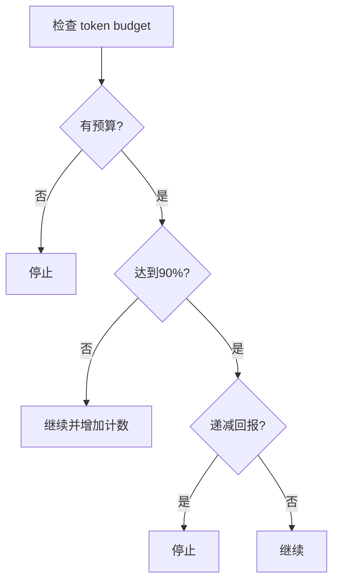

# TOKEN_BUDGET Feature Flag 详细分析

## 🎯 核心作用

`TOKEN_BUDGET` feature flag 启用 **Token 预算管理系统** - 一个智能的 token 使用控制和优化系统，用于管理 AI 对话中的 token 消耗。

## 📋 主要功能组件

### 1. Token Budget Tracking (tokenBudget.ts)
- **预算跟踪器**: `createBudgetTracker()` 创建预算跟踪状态
- **预算检查**: `checkTokenBudget()` 决定继续还是停止生成
- **决策逻辑**: 基于百分比阈值和递减回报检测

### 2. Token Budget Parsing (tokenBudget.ts)
- **解析用户输入**: `parseTokenBudget()` 解析 "+500k", "spend 2M tokens" 等格式
- **位置检测**: `findTokenBudgetPositions()` 在文本中高亮显示预算标记
- **消息生成**: `getBudgetContinuationMessage()` 生成继续工作提示

### 3. UI 集成
- **Spinner 显示**: 在加载界面显示当前 token 使用情况
- **REPL 支持**: 支持 `/btw` 命令设置临时预算
- **自动快照**: 记录每 turn 的 token 使用情况

### 4. 系统提示集成
- **系统提示**: 添加关于 token target 使用的说明
- **附件生成**: 生成 token 使用统计附件

## 🔧 工作原理

### Token Budget Decision Logic


### 关键阈值
- **完成阈值**: 90% (`COMPLETION_THRESHOLD = 0.9`)
- **递减阈值**: 500 tokens (`DIMINISHING_THRESHOLD = 500`)
- **最少连续次数**: 3 次 (`continuationCount >= 3`)

## 🚀 使用方式

### 用户输入格式
```
+500k     # 简写格式，+500,000 tokens
+2M      # +2,000,000 tokens
spend 1B tokens  # 详细格式
use 500k tokens  # 详细格式
```

### 自动检测位置
系统会自动在用户输入中查找这些模式：
- `+数字[k,m,b]` (简写)
- `spend/use 数字[k,m,b] tokens` (详细)

## 📊 技术实现细节

### Budget Tracker 数据结构
```typescript
type BudgetTracker = {
  continuationCount: number      // 连续继续次数
  lastDeltaTokens: number        // 上次检查后的 token 增量
  lastGlobalTurnTokens: number   // 上次检查时的总 token 数
  startedAt: number             // 开始时间戳
}
```

### Token Budget Decision
```typescript
type TokenBudgetDecision = ContinueDecision | StopDecision

// ContinueDecision: 继续生成
// StopDecision: 停止生成 + 完成事件信息
```

### UI 显示逻辑
- **Spinner 显示**: "Target: 1,234 used (500k min ✓)"
- **继续提示**: "Stopped at 90% of token target (450,000 / 500,000). Keep working — do not summarize."
- **自动继续**: 当接近目标时自动提示继续

## ⚙️ 配置和管理

### 启用条件
- 需要资源管理需求
- 主要用于 enterprise/internal 版本
- 控制成本和使用优化

### 状态管理
- **当前预算**: `getCurrentTurnTokenBudget()`
- **输出 token**: `getTurnOutputTokens()`
- **继续计数**: `getBudgetContinuationCount()`
- **快照**: `snapshotOutputTokensForTurn(budget)`

## 🎯 主要优势

1. **成本控制**: 防止无限制的 token 消耗
2. **效率优化**: 通过递减回报检测避免低效生成
3. **用户体验**: 清晰的 token 使用情况反馈
4. **自动化**: 智能的继续/停止决策
5. **灵活性**: 支持多种预算输入格式

## ⚠️ 注意事项

- **企业级功能**: 主要用于内部/企业版本
- **资源密集型**: 需要额外的状态管理和计算
- **用户教育**: 需要向用户解释 token budget 概念
- **边界情况**: 处理无预算、负预算等边缘情况

## 📈 影响范围

该功能影响以下方面:
- **查询系统**: 每个 turn 的 token 使用决策
- **用户界面**: Spinner 和 REPL 的预算显示
- **系统提示**: AI 助手的 token 使用指导
- **数据收集**: token 使用统计和报告

该 feature flag 代表了 Anthropic 对 AI 资源管理和成本控制的重视，提供了精细化的 token 使用控制能力。