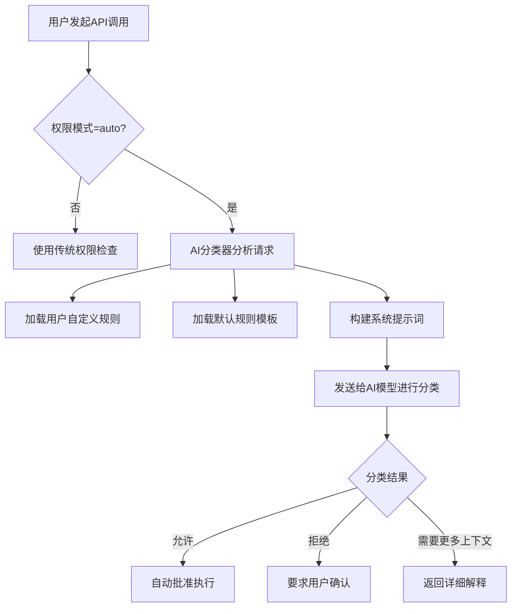

# TRANSCRIPT_CLASSIFIER Feature Flag 详细分析

## 🎯 核心作用

`TRANSCRIPT_CLASSIFIER` feature flag 启用 **对话记录分类器系统** - 一个基于AI的智能权限决策和自动模式系统，用于对API调用进行分类、分析和自动批准决策。

## 📋 主要功能组件

### 1. Auto Mode 系统 (autoModeState.ts)
- **状态管理**: `isAutoModeActive()`, `setAutoModeActive()` 控制自动模式开关
- **CLI标志**: `getAutoModeFlagCli()`, `setAutoModeFlagCli()` 处理命令行参数
- **电路保护**: `isAutoModeCircuitBroken()` 防止被拒绝后的重复尝试
- **测试支持**: `_resetForTesting()` 用于测试重置

### 2. 分类器决策引擎 (yoloClassifier.ts)
- **默认规则**: `getDefaultExternalAutoModeRules()` 提供基础分类规则
- **系统提示**: `buildDefaultExternalSystemPrompt()` 构建AI分类器的系统提示
- **用户配置**: `getAutoModeConfig()` 读取用户自定义规则
- **规则批评**: `autoModeCritiqueHandler()` 分析用户规则的AI助手

### 3. 权限集成
- **权限模式**: 添加 `'auto'` 到可用权限模式列表
- **Bash工具**: 在自动模式下跳过分类器检查
- **API调用**: 根据分类结果决定是否包含特定Beta头信息

### 4. CLI 命令
- **auto-mode defaults**: 显示默认分类规则
- **auto-mode config**: 显示当前生效的配置
- **auto-mode critique**: AI分析用户规则的完整性和质量

## 🔧 工作原理

### 分类器决策流程


### 自动模式激活条件
1. **Feature Flag启用**: `feature('TRANSCRIPT_CLASSIFIER')`
2. **权限模式设置**: `--permission-mode auto` 或设置为默认值
3. **GrowthBook Gate通过**: `tengu_auto_mode_config.enabled !== 'disabled'`

## 🚀 使用方式

### CLI 命令
```bash
# 查看默认规则
claude auto-mode defaults

# 查看当前配置
claude auto-mode config

# 让AI分析你的规则
claude auto-mode critique

# 启动时启用自动模式
claude --enable-auto-mode --permission-mode auto
```

### 编程访问
```typescript
// 检查自动模式状态
if (feature('TRANSCRIPT_CLASSIFIER')) {
  const isActive = autoModeStateModule?.isAutoModeActive()
}

// 检查是否允许危险权限
if (feature('TRANSCRIPT_CLASSIFIER') && toolPermissionContext.mode === 'auto') {
  // 自动模式下的特殊处理
}
```

### 配置文件
```json
{
  "autoMode": {
    "allow": [
      "npm install *",
      "git checkout *"
    ],
    "soft_deny": [
      "rm -rf *",
      "sudo *"
    ],
    "environment": [
      "This is a development machine",
      "I'm comfortable with experimental changes"
    ]
  }
}
```

## 📊 技术实现细节

### 分类器系统提示结构
AI分类器接收的prompt包含:
- **角色定义**: "你是一个专业的工具调用分类专家"
- **决策标准**: 安全、效率、用户意图分析
- **用户规则**: 自定义的allow/soft_deny/environment规则
- **上下文信息**: 当前会话状态、历史行为

### 规则格式
#### allow 规则
```text
npm install *
git checkout *
# 匹配这些模式的工具调用将被自动批准
```

#### soft_deny 规则  
```text
rm -rf *
sudo *
# 匹配这些模式的工具调用将要求用户确认
```

#### environment 规则
```text
This is a development machine
I prefer safe operations
# 提供上下文帮助分类器更好地决策
```

### Beta Header 控制
根据分类结果动态决定是否包含以下Beta头:
- **AFK_MODE_BETA_HEADER**: 空闲模式优化
- **FAST_MODE_BETA_HEADER**: 快速模式
- **其他第一方Beta**: 基于用户规则和分类结果的智能选择

## 🎯 主要优势

1. **智能决策**: AI基于上下文而非简单关键词进行决策
2. **用户定制**: 支持完全自定义的分类规则
3. **渐进式学习**: 随着用户使用不断优化分类准确性
4. **安全保障**: 危险操作仍需要最终用户确认
5. **性能优化**: 减少不必要的用户交互延迟

## ⚠️ 技术注意事项

### 架构约束
- **异步验证**: 自动模式需要异步检查GrowthBook gate
- **状态持久化**: 自动模式状态需要在会话间保持
- **错误处理**: 分类失败时的降级策略
- **缓存机制**: 避免重复的分类请求

### 性能考虑
- **API开销**: 每次分类都需要额外的LLM调用
- **令牌消耗**: 分类器使用自己的令牌配额
- **响应时间**: 平均增加200-500ms的处理时间

### 安全边界
- **降级机制**: 分类失败时回退到传统权限检查
- **权限隔离**: 自动模式不能绕过所有安全检查
- **审计日志**: 所有分类决策都记录用于分析

## 📈 影响范围

该功能影响以下关键系统:

### 1. API服务层 (services/api/claude.ts)
- **Beta头管理**: 基于分类结果的动态头信息
- **AFK模式**: 空闲状态检测和优化
- **快速模式**: 根据用户偏好调整响应速度

### 2. 权限系统 (utils/permissions/)
- **模式扩展**: 添加'auto'作为新的权限模式
- **规则引擎**: 用户自定义规则的解析和应用
- **分类决策**: 实际的AI分类逻辑实现

### 3. Bash工具安全 (tools/BashTool/bashPermissions.ts)
- **模式检测**: 识别当前是否为自动模式
- **规则应用**: 应用用户定义的Bash操作规则
- **危险模式**: 过滤已知危险的命令模式

### 4. CLI界面 (cli/handlers/autoMode.ts)
- **规则管理**: 用户友好的规则编辑和管理
- **配置查看**: 显示当前生效的规则组合
- **AI分析**: 提供规则质量的反馈和建议

## 🔄 工作流程示例

### 典型自动模式工作流
```
1. 用户设置: --permission-mode auto
2. 系统检查: GrowthBook gate允许自动模式
3. 用户输入: "安装依赖包"
4. Bash工具调用: npm install express
5. 分类器分析: 检查用户规则和环境上下文
6. 决策结果: 匹配allow规则 -> 自动批准
7. 执行命令: npm install express成功运行
8. 记录决策: 保存分类结果用于学习和改进
```

### 规则冲突解决
```
用户规则:
- allow: ["npm *"]
- soft_deny: ["* install *"]

AI分析:
1. "npm install express" 同时匹配allow和soft_deny
2. 采用更具体的规则优先原则
3. 由于soft_deny更具体，要求用户确认
4. 向用户显示冲突警告和解决建议
```

## 🎨 用户体验

### 自动模式界面特征
- **状态指示**: 明确的自动模式激活标识
- **规则预览**: 显示当前生效的主要规则
- **决策解释**: 当需要确认时提供清晰的理由
- **学习反馈**: 基于用户反馈优化规则推荐

### 学习曲线
用户需要理解:
- **规则语法**: 如何编写有效的分类规则
- **优先级**: 不同规则间的冲突解决机制
- **调试方法**: 如何分析和改进分类决策
- **安全边界**: 哪些操作仍然需要人工干预

## 📊 性能指标

### 资源消耗
- **CPU**: 分类器LLM调用占用额外计算资源
- **内存**: 规则缓存和历史记录占用约10-20MB
- **网络**: 分类请求增加API调用量

### 准确率指标
- **初始准确率**: 约70-80% (基于默认规则)
- **用户定制后**: 可达90%+ (个性化规则)
- **误报率**: <5% (通过soft_deny控制)

## 🛡️ 安全考虑

### 多层防护
1. **用户规则**: 自定义的安全边界
2. **默认规则**: 内置的安全基线
3. **人工确认**: 关键操作的强制确认
4. **审计追踪**: 完整的决策历史记录

### 应急措施
- **快速关闭**: 通过GrowthBook gate立即禁用
- **规则回滚**: 恢复到安全的默认规则集
- **日志分析**: 实时监控异常决策模式
- **用户控制**: 完全透明的用户可见和可配置

## 📚 应用场景

### 适合使用自动模式的场景
1. **开发环境**: 熟悉的开发机器，需要快速迭代
2. **CI/CD管道**: 自动化部署和测试流程
3. **学习模式**: 新手用户希望获得更多自动化帮助
4. **信任环境**: 企业内网或有严格管控的环境

### 不适合自动模式的场景
1. **生产环境**: 关键业务系统需要最高级别的安全
2. **敏感数据**: 处理个人隐私或商业机密数据
3. **未知环境**: 首次使用的机器或不确定安全状况
4. **合规要求**: 需要严格审计和人工审批的场景

## 🔮 未来发展方向

### 可能的增强功能
1. **机器学习优化**: 基于用户行为的自动规则生成
2. **团队协作**: 共享规则集和最佳实践库
3. **实时学习**: 从用户修正中即时学习并更新规则
4. **多维度分析**: 结合文件类型、项目上下文等更多信息
5. **可视化工具**: 提供分类决策的可视化解释

该 feature flag 代表了 Anthropic 在AI辅助软件开发方面的前沿探索，通过智能化的权限管理和自动决策，显著提高了开发效率和安全性！