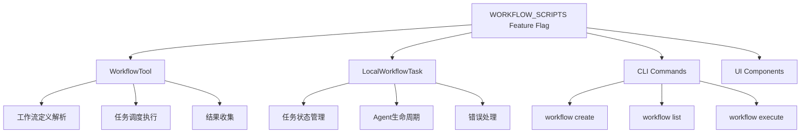

# WORKFLOW_SCRIPTS Feature Flag 详细分析

## 🎯 核心作用

`WORKFLOW_SCRIPTS` feature flag 启用 **工作流脚本系统** - 一个自动化任务执行框架，允许用户定义、管理和运行复杂的自动化工作流。

## 📋 主要功能组件

### 1. Workflow Tool (src/tools/WorkflowTool/)
- **WorkflowTool**: 主要的工具入口点，提供工作流创建和执行功能
- **WorkflowPermissionRequest**: 工作流权限请求处理组件
- **createWorkflowCommand**: 工作流相关的CLI命令处理器

### 2. Local Workflow Task (src/tasks/LocalWorkflowTask/)
- **LocalWorkflowTask**: 本地工作流任务的实现
- **任务管理**: killWorkflowTask, skipWorkflowAgent, retryWorkflowAgent 等操作
- **状态管理**: LocalWorkflowTaskState 定义任务状态结构

### 3. 用户界面组件
- **WorkflowDetailDialog**: 工作流详情对话框组件
- **WorkflowMultiselectDialog**: 多选工作流对话框
- **BackgroundTasksDialog集成**: 在工作流对话框中显示相关任务

### 4. 命令行接口
- **getWorkflowCommands**: 工作流相关的CLI命令集合
- **集成到主命令系统**: 通过feature flag条件加载

## 🔧 工作原理

### 工作流执行架构


### 工作流生命周期
1. **定义阶段**: 用户创建工作流脚本或从模板选择
2. **配置阶段**: 设置参数、环境变量和依赖关系
3. **验证阶段**: 语法检查、权限验证和资源预检
4. **执行阶段**: 按计划或手动触发执行
5. **监控阶段**: 实时跟踪进度和状态更新
6. **完成阶段**: 结果汇总、日志记录和通知

## 🚀 使用方式

### CLI 命令
```bash
# 查看可用工作流命令
claude workflow --help

# 创建工作流
claude workflow create my-workflow.yaml

# 列出工作流
claude workflow list

# 执行工作流
claude workflow run my-workflow

# 管理工作流状态
claude workflow status
claude workflow stop <id>
```

### 编程访问
```typescript
// 检查工作流工具是否可用
if (feature('WORKFLOW_SCRIPTS')) {
  const workflowTool = require('./tools/WorkflowTool/WorkflowTool.js').WorkflowTool;
  // 创建工作流实例
  const workflow = new workflowTool.Workflow();
}

// 获取工作流命令
const getWorkflowCommands = feature('WORKFLOW_SCRIPTS')
  ? require('./tools/WorkflowTool/createWorkflowCommand.js').getWorkflowCommands
  : null;
```

### 工作流定义格式
```yaml
# example-workflow.yaml
name: "代码审查工作流"
description: "自动审查PR并生成报告"
version: "1.0.0"

triggers:
  - type: "github_pr_opened"
    branches: ["main", "develop"]
  - type: "schedule"
    cron: "0 9 * * 1-5" # 工作日早上9点

steps:
  - name: "代码扫描"
    action: "agent"
    prompt: "审查此PR的代码质量，查找潜在问题"
    timeout: 300 # 5分钟

  - name: "运行测试"
    action: "shell"
    command: "npm test"
    depends_on: ["代码扫描"]

  - name: "生成报告"
    action: "write_file"
    path: "reports/review.md"
    content: "{{step_1.result}}"

notifications:
  - type: "slack"
    channel: "#dev-team"
    when: ["on_success", "on_failure"]
```

## 📊 技术实现细节

### 工具常量定义
```typescript
// src/tools/WorkflowTool/constants.ts
export const WORKFLOW_TOOL_NAME: string = 'workflow';
```

### 任务状态结构
```typescript
// src/tasks/LocalWorkflowTask/LocalWorkflowTask.ts
export type LocalWorkflowTaskState = TaskStateBase & {
  type: 'local_workflow'
  summary?: string      // 工作流摘要信息
  description: string   // 工作流描述
}
```

### 权限控制
- **子代理限制**: 防止递归工作流执行
- **危险操作保护**: 需要明确的用户授权
- **资源配额**: 限制并发工作流数量

## 🎯 主要优势

1. **自动化执行**: 无需人工干预的重复任务自动化
2. **灵活配置**: YAML格式的工作流定义，易于理解和维护
3. **事件驱动**: 基于GitHub事件或其他触发器的自动执行
4. **状态管理**: 完整的工作流执行状态跟踪
5. **错误恢复**: 内置的错误处理和重试机制

## ⚠️ 技术注意事项

### 架构约束
- **ANT-only**: 主要用于内部开发团队，外部版本默认禁用
- **静态导入**: 使用require()动态加载以避免外部构建中的代码泄露
- **死代码消除**: 构建时根据feature flag进行条件编译

### 性能考虑
- **资源隔离**: 每个工作流在独立的任务环境中运行
- **并发控制**: 限制同时执行的工作流数量
- **内存管理**: 及时清理已完成工作流的资源

### 安全边界
- **权限验证**: 所有工作流操作都需要适当的权限
- **输入验证**: 严格验证工作流定义和参数
- **沙箱环境**: 限制工作流对系统的访问权限

## 📈 影响范围

该功能影响以下关键系统:

### 1. 工具池管理 (src/utils/toolPool.ts)
- **工具过滤**: 根据feature flag决定是否包含WorkflowTool
- **权限上下文**: 工作流相关的特殊权限规则

### 2. 任务系统 (src/tasks.ts)
- **任务注册**: LocalWorkflowTask的注册和管理
- **状态同步**: 与全局任务状态的同步机制

### 3. 权限决策 (src/utils/permissions/classifierDecision.ts)
- **工具名称**: WORKFLOW_TOOL_NAME的动态定义
- **分类规则**: 工作流工具的权限分类策略

### 4. 用户界面 (src/components/)
- **任务对话框**: 工作流任务的显示和管理界面
- **权限请求**: 工作流操作的权限确认界面

## 🔄 典型工作流示例

### GitHub PR 自动审查工作流
```
1. 触发: PR创建到main分支
2. 步骤1: 代码质量扫描
   - 调用AI分析代码变更
   - 检查编码规范和安全问题
3. 步骤2: 单元测试
   - 运行相关的测试套件
   - 验证新功能不破坏现有功能
4. 步骤3: 文档更新检查
   - 确保API文档与代码一致
   - 检查README更新需求
5. 步骤4: 生成审查报告
   - 汇总所有检查结果
   - 发送给PR作者和相关人员
```

### CI/CD 部署工作流
```
1. 触发: 代码推送到release分支
2. 步骤1: 构建和测试
   - 编译项目
   - 运行完整的测试套件
3. 步骤2: 安全扫描
   - 检查依赖漏洞
   - 代码静态分析
4. 步骤3: 部署准备
   - 打包应用
   - 准备部署清单
5. 步骤4: 生产部署
   - 执行蓝绿部署
   - 验证部署成功
6. 步骤5: 监控和告警
   - 启动监控检查
   - 发送部署通知
```

## 🛡️ 安全考虑

### 多层防护机制
1. **用户授权**: 所有工作流操作都需要明确授权
2. **输入验证**: 严格验证工作流定义和参数
3. **资源限制**: 限制工作流使用的计算资源
4. **审计日志**: 完整的操作历史记录

### 应急措施
- **快速停止**: 支持随时停止正在运行的工作流
- **回滚能力**: 能够恢复到之前的稳定状态
- **故障隔离**: 单个工作流失败不影响其他工作流
- **权限撤销**: 可以立即撤销特定工作流的权限

## 📚 应用场景

### 适合使用工作流自动化的场景
1. **代码审查**: 自动化PR审查和反馈
2. **CI/CD管道**: 构建、测试和部署流程
3. **数据同步**: 定期数据备份和处理
4. **监控告警**: 系统和应用监控响应
5. **批量处理**: 大规模数据处理和分析

### 不适合工作流的场景
1. **简单任务**: 一次性或很少重复的任务
2. **交互式任务**: 需要用户实时决策的操作
3. **敏感操作**: 涉及关键业务决策的操作
4. **调试目的**: 临时性的调试和实验

## 🔮 未来发展方向

### 可能的增强功能
1. **可视化编辑器**: 拖拽式工作流设计界面
2. **模板市场**: 共享和下载工作流模板
3. **智能推荐**: 基于项目类型的自动化建议
4. **机器学习**: 基于历史数据的优化建议
5. **集成扩展**: 更多第三方服务的原生集成

### 企业级功能
1. **团队协作**: 多人协作编辑工作流
2. **版本控制**: 工作流定义的Git版本管理
3. **审批流程**: 复杂工作流的审批机制
4. **性能分析**: 工作流执行的详细性能报告
5. **成本优化**: 资源使用成本分析和优化建议

该 feature flag 代表了 Anthropic 在多任务自动化和DevOps流程现代化方面的探索，为复杂的软件工程工作流提供了强大的基础设施支持！